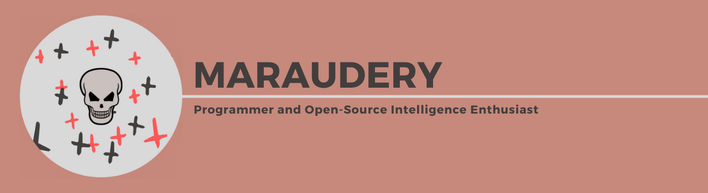
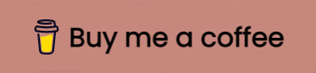

## About me
- 💻 I’m currently working on [Omniscient](https://github.com/maraudery/omniscient) and [Fluid](https://github.com/maraudery/fluid)
- 🌱 I’m currently learning Golang and Rust
- 🌐 Visit my [Website](https://maraudery.github.io)!
- 💬 Ask me about anything, I am happy to help
- 📫 How to reach me: maraudery@protonmail.com

**Show some love by starring a repository! See the projects I am proudest of below:**
